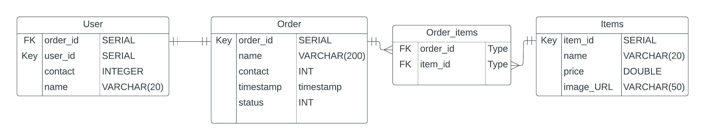
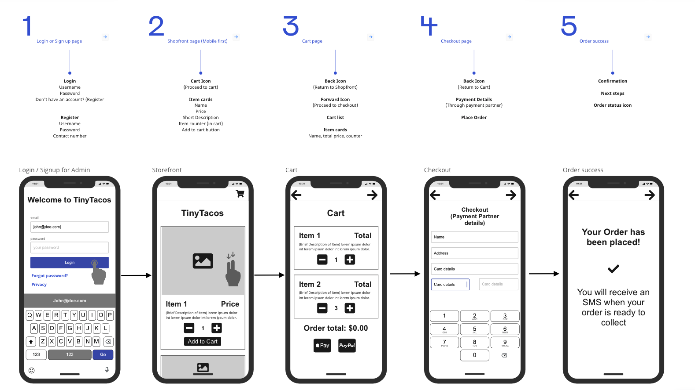
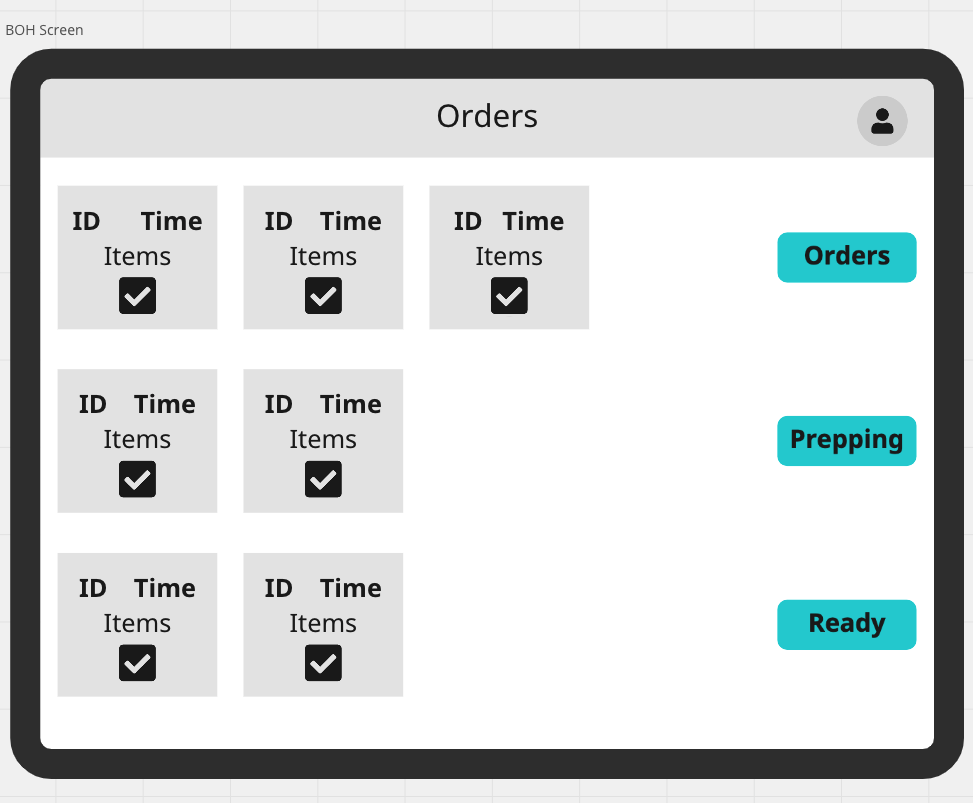
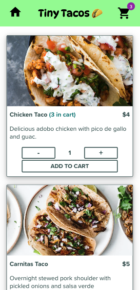
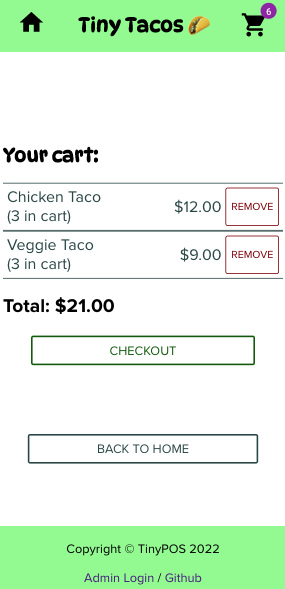
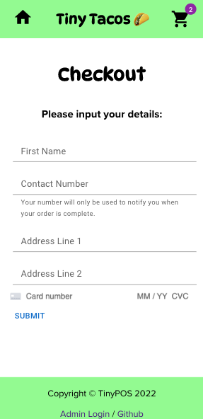
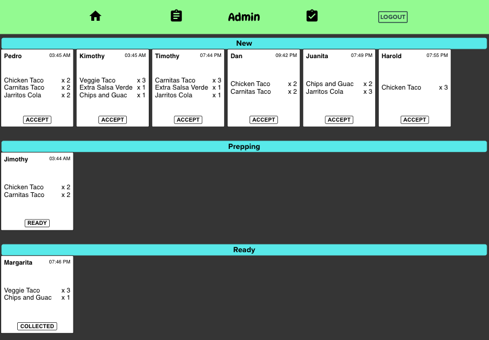

# TinyPOS
### A Point-Of-Sale system for micro catering businesses

A live version of the app can be found [here](https://tinypos-app.herokuapp.com/) - please read the "viewing the app" section below.

TinyPOS is a full-stack webapp designed to democratise Point-Of-Sale software for small businesses that can't afford the pricing and features of large industry POS providers.

Customers can access the shop-front site through the base route, and admin can log in through a discreet link in the footer - or with a direct link to the login page.

The CRUD (Create, Read, Update, Delete) functionality for the shop items is behind a protected route, meaning a validated user account is needed in order to make any changes to the backend. On top of this; users are required to know a "Secret Phrase" when setting up an account - only allowing validated staff that access.

This app was built with:
- HTML / CSS / JavaScript
- React JS
- Python & Flask
- PostgreSQL

Dependencies (Python API):
- flask
- psycopg2
- python-dotenv
- twilio
- gunicorn

Dependencies (React JS):
- react-router-dom
- @mui/material (+@emotion/react, +@emotion/styled)
- @stripe/stripe-js (+@stripe/react-stripe-js)

##### Installation

Fork and clone, or just clone the TinyPOS repo onto your local machine. Using pipenv, run a `$pipenv install` to install all the Python dependencies in the root folder. Then CD into the `client` folder and run a `npm install` to set up the React app.

In the root folder, create a `.env` file which contains:
- SECRET_KEY (of your choosing)
- SECRET_PHRASE (to validate new user registration)
- DATABASE_URL (`(host)://(db_user):(password)@(host)/(database)`)
- TWILIO_AUTH_TOKEN (a free account can be set up with [Twilio](https://www.twilio.com/try-twilio))
- TWILIO_AUTH_TOKEN
- TWILIO_NUMBER

Once the above are set up you can run the `seed/run.sql` file in the root folder in PostgreSQL, this will set up your database and seed some initial products.

Happy hacking!

##### Viewing the app

To access the admin route please user the demo account (username: demo, password: password)

The customer-facing app is designed as **mobile first** so is best viewed on a device viewer set to vertical mobile view.

The admin route, including the orders screen, is designed to be rendered on a small - medium tablet (iPad or similar) so is best viewed on a device viewer set to a tablet view.

## Design

### User Stories

As a starting point for designing the app, some user stories were written to encapsulate the project brief:

*“Jane has a food truck, she has found that post-pandemic it has been hard to find enough casual workers to consistently staff her food truck. One person in the kitchen, one front of house and one running food is too risky when one of them could call in sick at any point. She wants to do everything herself.”*

*“Anthony is a foodie, he loves supporting local businesses and wants to spend his money on small, sustainable businesses rather than large food chains but finds the contact-free ordering systems at those chains quick and easy to use.”*

*“Juanita owns an ice-cream stall and wants a system to manage her front-of-house orders as well as her current orders. She doesn’t want to pay out for one of the POS systems that are feature heavy and expensive”*

*“Paulo is a casual worker who wants to pick up extra work hours at the weekend but doesn’t have in-depth knowledge of cooking processes or customer service.”*

*“Petra has a chain of taco stalls and vans and wants her product to be more standardised across her casual worker teams without having to pay the staff hours required for training.”*

### MVC

The initial design process was to figure out the `Models, Views, Controllers` setup and build out from that.

#### Models
- Products
- Users
- Orders

#### Views
- Customer (Mobile)
- Admin / Orders (Tablet)

#### Controllers
- Products
- Users
- Orders

### ERD

An Entity Relationship Diagram was sketched out in order to understand the database tables required and the relationships between them:

A separate table, orders_items would be needed to manage the many-to-many relationship between the orders and items; as both items and orders could be linked to multiple of each other.

The decision was made later to include the `total` amount column for each order, for future data analysis, as well as a `item_name` column for the order_items - to cut down on front-end processing for each order_items request.

### Wireframes

Some wireframes were drawn up in Miro to draft some basic UI, in order to plan out components. The majority of the design features would be implemented in the final version.

The routes for the mobile app were developed to be as simple as possible, with as few clicks as possible to get to checkout. In the end JavaScript `localStorage` functionality was used to store cart data instead of a login route for all customers. This saves the customer having to set up an account to purchase items, increasing the likelihood of a sale.

Buttons and clickable items were designed to be as large as possible, without looking cumbersome - following the mobile-first design principle.

A simple design was also drawn up for the Back-of-house Orders screen, to move orders down the rails by order of status.

A Google forms survey was sent to some ex-colleagues in Kitchen roles. The feedback was that the most important information to display was:
- The ID / table number
- Timestamp
- Order items

With this in mind a very simple card layout was designed to mimic a kitchen order docket, with just the basic information and an easy-to-use button to sequence the orders through their various stages. Kitchen staff were opposed to any radical redesign of this part, so steps were taken to make the dockets familiar and not in any way challenging.

The form also asked about buttons vs. drag-and-drop, the overwhelming response was that buttons are much preferred due to ease of use and minimising mistakes.

## Implementation

### Front-end

The front end was built in React, with the majority of the logic and state living in `app.js`. This reduced the need for additional logic files and kept the component tree streamlined.

Components were built out into separate files, to allow for an easy separation of concerns. The main states and their useEffect functions to flow through the components are:
- `Products` (loaded on mount from the Database)
- `Orders` (loaded every 5 seconds from the Database on an interval timer)
- `Cart` (lives in localStorage to persist refreshes)
- `User auth` (checked on all of the protected routes)

All of the customer routes are accessible from the `/home` route, with a discreet link to the Admin login page in the footer.

A staff member can access the admin routes through the `users/login` route or by trying to hit any of the protected routes - which if not logged in - redirect the user back to the login page.

#### Products

The full CRUD functionality for the products list is hidden from the customer, and can only be accessed via a valid login

#### Orders

The same is true with the orders, which can be accessed from the Orders button on the admin navbar.

#### Cart

The `cart` contents are automatically added to the browser's localStorage, allowing them to survive page refreshes without having to use session data. The app will check if there is a localStorage `cart` item on mount, and if so will get it's contents.

#### User auth

Is accessed on mount and on user change. This allows access to the admin routes.

#### Styling
The vast majority of the styling was written in CSS by myself, some components such as the `Form` components and `Loading Spinner` came from the MUI component library - but I decided early on I wanted full control of all the component styling so limited use of external libraries.

A Card Auth form field was imported from `Stripe`, but this was for display purposes only.

For the customer front-end a simple card-based structure was the easiest setup. `Proxima Nova` was chosen as the overall font as a nice compromise between legibility and being aesthetically pleasing. The `h1` font throughout is `Dynapuff`, which adds a nice informal touch as well as some rounded shapes in an otherwise very linear-looking app. For the same reason the `palegreen` colour was chosen for the navbars and footer - adding a little bit of character to the screen without looking too informal.

For the Kitchen dockets a simple white background and `Helvetica` font was chosen to improve legibility from afar.The dark background helps the orders stand out and also helps the staff read contents quickly.

### Backend

The backend functionality was built in Python using Flask and PostgreSQL. The relational data required for the orders and items meant an SQL database made the most sense, rather than an Object-Oriented-Database like MongoDB.

#### Psycopg2

The query calls were written out in Python and given to `psycopg2`, which handles all of the database queries. The various controllers are broken into sections in `app.py`, with the minimum amount of processing needed.

A separate `db.py` file handles the code needed to connect and disconnect from the database.

A iterating query was needed to populate and pull data from the `order_items` table to populate the items List for each order. This was done with a query nested in a simple `for in` loop to minimise processing on the front end.

#### Twilio

The backend API also connects to the Twilio API when an order is completed. This send the customer's contact number to the Twilio API, which then sends the customer an SMS to confirm their order is ready to collect.

Twilio integration was easy and fast. It is deactivated for the publicly deployed app as it can only access a limited list of numbers.

## App images

Some renders of the app.

*Index Route:*

*Cart:*

 

*Checkout*

*Orders Screen:*

## Stretch Goals

Given the limited amount of time for the project, not all of the initial stretch goals made it into the final version. Some of the future functionality I would like to build in is:

#### Ingredients / Instructions
A tab on each order item opens a nested route which displays basic recipe for that item, allowing someone with minimal training to assemble the products easily and in the correct order.

#### Dietaries
Integrated with the above would be the ability for the customer to selected certain dietaries, and have their product list tailored to their needs. It would also then inform the kitchen team about these dietary requirements to avoid cross-contamination of food.

#### Accessibility
The option to render the customer or Back Of House screen using a more accessible font such as [Dyslexie](https://www.dyslexiefont.com/) or adding different styling options for the Back Of House orders screen, such as a dark background, to improve accessible reading.

#### Better large-screen rendering
As the app was developed for mobile view it loses some visual appeal on larger screens. Given more time I would polish the CSS for larger `media-queries` so larger screens render in a more standardised layout. I also wanted to add a "order progress" icon on the customer "Order Success" which tracks the status of the order moving through the Back Of House order rails, so the Customer can see how close to completion the order it.

#### Full POS services
The checkout features are basically a mockup, I would like to develop these out into a fully functioning payment screen which processes electronic payment and saves the daily transactions into a Data-analysis table - allowing easy viewing of sales data across daily, weekly or monthly time periods. Possibly the introduction of a `till` route which displays the current completed orders and facilitates cash payments. The `stripe` dependency could be properly integrated to handle most of this processing. At the moment it's only function in the app is the Credit Card strip on the payment page.

#### Input validation
More thorough user input validation is required for both the checkout and admin-edit routes. Currently the checkout form is more of a mockup, with limited enforcement of telephone, address and card details. I would like more logic on the form before it is accepted, perhaps with flash messages back to the user where fields are incorrect or the wrong format.

There are many other features I would like to implement onto this project. Hopefully I will find the time!
